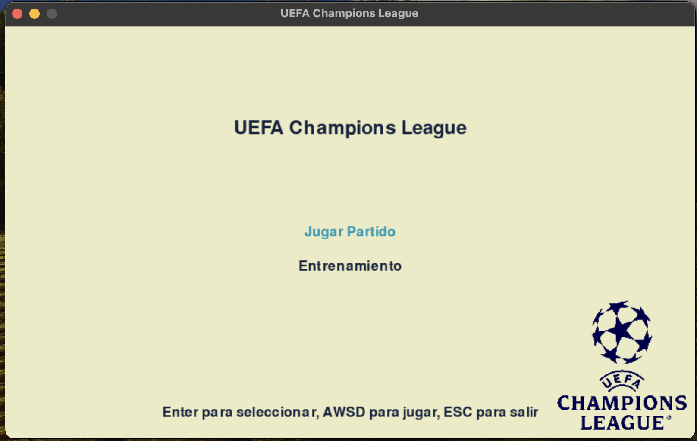
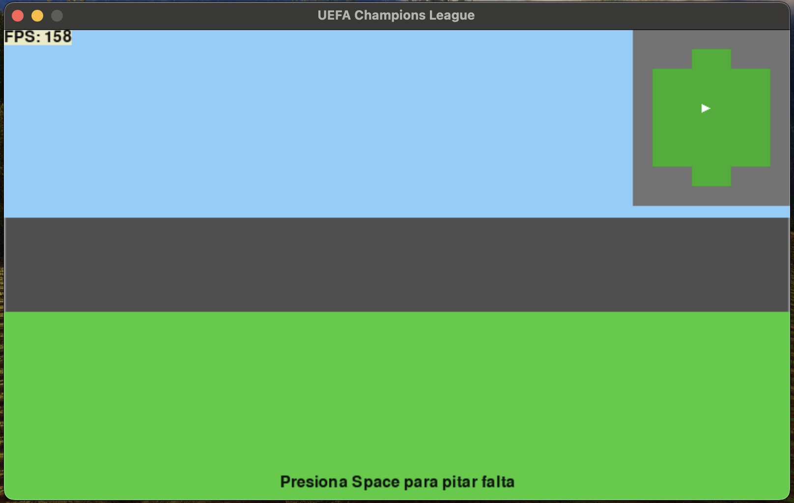
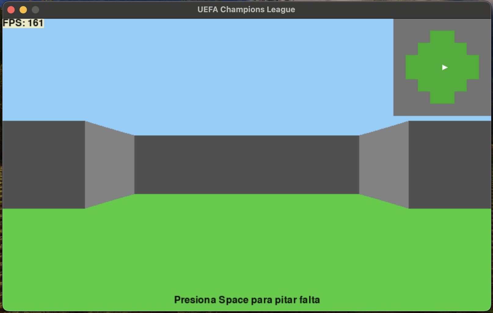

# PRY2_GC: Ray Caster con PyGame

## Descripción
Este proyecto presenta un Ray Caster simple implementado con PyGame. Diseñado para ser jugado en una Raspberry Pi, ofrece una experiencia de juego fluida y desafiante con la garantía de no atravesar paredes y un rendimiento estable.

## Características
- Jugabilidad en niveles meticulosamente diseñados.
- Física sólida: imposibilidad de atravesar paredes.
- Estabilidad garantizada: sin crashes durante el juego.

## Pantalla de Inicio

## Niveles del Juego
### Partido

### Entrenamiento

## Demostración en RaspberryPi
Echa un vistazo al juego en acción en una Raspberry Pi a través de este [video](https://youtu.be/tZyVJ9gDWZc).
